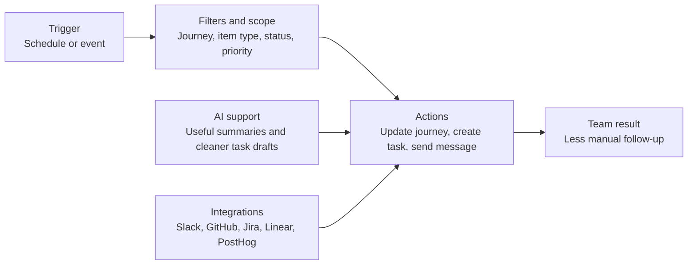

Automations keep your [journey](/journeys) current without manual follow-up every time something important changes.

They help your team pull [signals](/signals), create work, notify the right people, and refresh context on a schedule or in response to real events.

## Where automations help first

Use this page to understand:

- what automations are good for
- which workflows make sense to automate first
- where AI and integrations fit

For small teams, automations reduce coordination overhead in the moments that happen constantly:

- an item becomes important
- a signal moves in analytics
- a PR gets merged
- the team needs a recurring summary

## What automations can do

Custory automations can:

- update journeys with AI instructions
- create GitHub, Jira, or Linear issues
- send Slack or Discord messages through [integrations](/integrations)
- pull analytics [signals](/signals)
- fetch [GitHub PR context](/github-integration)

## Good first automations

Most founder-led teams should start with one of these:

- a weekly journey pulse to Slack or Discord
- a priority-to-task handoff workflow
- a GitHub merged PR journey refresh
- a PostHog or Stripe signal workflow

Each solves a real coordination problem without requiring a large automation program.

## The automation model

Every automation has three main parts:

- a trigger
- optional filters or scope
- one or more actions

## Start with templates

Custory includes templates for common automation patterns so you do not need to build from zero every time.

See [Templates](/automation-templates).

## Where AI helps most

AI is useful when the workflow needs context-aware writing instead of static templates.

Examples:

- writing a useful weekly journey summary
- drafting a clearer issue from real journey context
- updating the journey after a GitHub merge or analytics change

## How an automation is put together

Every automation has three main layers:

1. a trigger
2. optional filters or scope
3. one or more actions

Those layers can also use [AI](/ai-workspace-member) and [integrations](/integrations) where the workflow needs them.

If you understand those layers, you can build smaller, clearer workflows.

That usually leads to better results than trying to automate an entire operating system in one step.

  
  

## Trigger types

Custory supports both scheduled and event-based triggers.

### Scheduled triggers

Use scheduled triggers for recurring review and reporting rhythms:

- hourly
- daily
- weekly

### Event-based triggers

Use event-based triggers when the workflow should react the moment something important changes.

Supported examples include:

- item created
- item updated
- item status changed
- impact threshold crossed
- effort threshold crossed
- priority threshold crossed
- [GitHub PR](/github-integration) opened
- [GitHub PR](/github-integration) merged

## Filters and scope

Filters keep automations useful by narrowing where they apply.

Common controls include:

- [journey](/journeys)
- item group
- status
- impact
- effort
- changed fields
- repository
- base branch

Good automation design usually starts with tighter scope than you think you need.

## Actions

Actions are what the automation does after the trigger and filters match.

Common actions include:

- create a GitHub, Jira, or Linear issue
- send a Slack or Discord update
- update the journey
- fetch or refresh external context

Choose actions based on the real handoff you want to reduce.

## AI-drafted actions

AI is useful when an action needs better writing instead of a static template.

That helps with:

- cleaner issue titles and descriptions
- more useful Slack or Discord summaries
- context-aware journey updates

## Lifecycle and control

Automations move through statuses such as:

- draft
- active
- paused
- invalid when setup requirements are not met

Custory also supports:

- validation before activation
- manual runs for scheduled automations
- run-history review
- pausing and reactivating

## Start with one workflow the team will trust

Start with the smallest useful workflow.

Example:

- Trigger: high-priority opportunity created
- Filter: only in the onboarding journey
- Action: create a Linear issue and send a Slack update

That is easier to trust, test, and improve than a large multi-step automation from day one.

## Mistakes that create noise

<AccordionGroup>
  <Accordion title="Automating before the journey data is current">
    Automations amplify the underlying data quality. Clean up statuses, ownership, and [items](/items) quality first so the workflow is acting on signals your team already trusts.
  </Accordion>
  <Accordion title="Starting with too many workflows">
    One reliable automation is better than several noisy ones the team ignores. Start with the repeated workflow that already causes the most friction and prove value there first.
  </Accordion>
  <Accordion title="Automating a habit the team has not proven yet">
    If the workflow is not recurring, you may not need automation yet. Build the habit manually once or twice, then automate the parts that clearly repeat.
  </Accordion>
  <Accordion title="Using a broad trigger with weak filters">
    That usually creates noise. Start narrower than you think you need, then widen the scope only after the workflow proves useful and trustworthy.
  </Accordion>
  <Accordion title="Choosing actions before the outcome is clear">
    Start from the operational job, then map the action. If the team cannot explain what the automation should improve, the action layer will usually become arbitrary.
  </Accordion>
  <Accordion title="Expecting AI to fix a vague workflow">
    AI improves a clear workflow. It does not rescue an unclear one. Define the trigger, scope, and expected output first, then use AI to make the result stronger.
  </Accordion>
</AccordionGroup>

## What good automation design looks like

A good automation setup:

- reduces repeated manual work
- keeps customer context attached to follow-up
- sends only useful updates
- is easy for the team to trust

## Next step

- Read [Templates](/automation-templates) for faster starting points.
- Read [Build with AI](/build-automations-with-ai) if you want help configuring workflows from plain-language goals.
- Read [Overview](/integrations) if the workflow depends on Slack, Discord, GitHub, Jira, Linear, or analytics connections.
