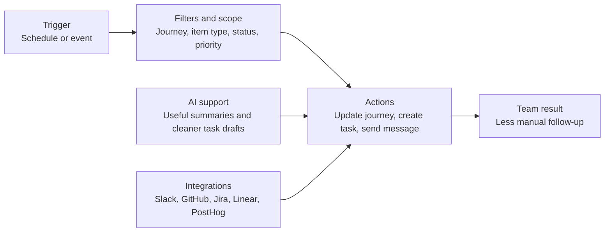

Automations keep your [journey](/journeys) current without manual follow-up every time something important changes.

They help your team pull [signals](/signals), create work, notify the right people, and refresh context on a schedule or in response to real events.

This page is the overview: what automations are for, where they help first, and when they are worth using. Read [How automations work](/how-automations-work) for the build model of triggers, filters, actions, and AI behavior.

## What automations are good at

Use this page to understand:

- what automations are good for
- which workflows make sense to automate first
- where AI and integrations fit

For lean teams, automations reduce coordination overhead in the moments that happen constantly:

- an item becomes important
- a signal moves in analytics
- a PR gets merged
- the team needs a recurring summary

## What automations can do

Custory automations can:

- update journeys with AI instructions
- create GitHub, Jira, or Linear issues
- send Slack or Discord messages through [integrations](/integrations)
- pull analytics [signals](/signals)
- fetch [GitHub PR context](/github-integration)

## Good first automations

Most founder-led teams should start with one of these:

- a weekly journey pulse to Slack or Discord
- a priority-to-task handoff workflow
- a GitHub merged PR journey refresh
- a PostHog or Stripe signal workflow

Each solves a real coordination problem without requiring a large automation program.

## The core automation model

Every automation has three main parts:

- a trigger
- optional filters or scope
- one or more actions

Read [How automations work](/how-automations-work) for the detailed model.

## Start with templates

Custory includes templates for common automation patterns so you do not need to build from zero every time.

See [Automation templates](/automation-templates).

## Where AI helps most

AI is useful when the workflow needs context-aware writing instead of static templates.

Examples:

- writing a useful weekly journey summary
- drafting a clearer issue from real journey context
- updating the journey after a GitHub merge or analytics change

## Mistakes that create noise

<AccordionGroup>
  <Accordion title="Automating before the journey data is current">
    Automations amplify the underlying data quality. Clean up statuses, ownership, and [items](/items) quality first so the workflow is acting on signals your team already trusts.
  </Accordion>
  <Accordion title="Starting with too many workflows">
    One reliable automation is better than several noisy ones the team ignores. Start with the repeated workflow that already causes the most friction and prove value there first.
  </Accordion>
  <Accordion title="Automating a habit the team has not proven yet">
    If the workflow is not recurring, you may not need automation yet. Build the habit manually once or twice, then automate the parts that clearly repeat.
  </Accordion>
</AccordionGroup>

## A strong first automation setup

A good automation setup:

- reduces repeated manual work
- keeps customer context attached to follow-up
- sends only useful updates
- is easy for the team to trust

## Next step

- Read [How automations work](/how-automations-work) for triggers, filters, and actions.
- Read [Automation templates](/automation-templates) for faster starting points.
- Read [Build automations with AI chat](/build-automations-with-ai) if you want help configuring workflows from plain-language goals.
- Read [Integrations](/integrations) if the workflow depends on Slack, Discord, GitHub, Jira, Linear, or analytics connections.
