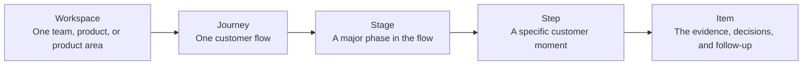

Custory works best when your team shares the same model of how customer context is stored, discussed, and moved forward.

## What this is

This page explains the core objects in Custory and how they fit together:

**Workspace -> Journey -> Stage -> Step -> Item**

If you understand that model, the rest of the product becomes much easier to use well.

## Why it matters

Custory is not just a place to draw a flow.

It gives your team one shared system for:

- mapping the customer experience
- attaching evidence to the right moment
- framing problems worth solving
- linking follow-up work
- using AI and automations from real context

The model matters because it keeps the customer story readable even as the workspace grows.

## The core model

### Workspace

A [workspace](/workspace) is the shared home for one team, one product, or one product area.

It contains:

- members and roles
- journeys
- personas
- integrations
- notifications
- automations
- AI memory and MCP access

### Journey

A [journey](/journeys) is the main map of a customer flow.

Examples:

- new user onboarding
- activation
- trial to paid
- support escalation
- renewal risk

### Stage

A stage is a major phase in the journey.

Examples:

- discovery
- evaluation
- setup
- first value
- retention

### Step

A step is a specific customer moment inside a stage.

Good step names are concrete:

- Customer reads pricing page
- Customer connects Slack
- Customer invites teammate

### Item

An [item](/items) is a structured piece of context attached to the journey.

Custory supports five main item groups:

- [Touchpoints](/touchpoints)
- [Insights](/insights)
- [Opportunities](/opportunities)
- [Solutions](/solutions)
- [Metrics](/metrics)

This is where the journey stops being just a diagram and becomes useful for decisions.

## How the item model works

The item model helps teams move from evidence to action.

### What each item type does

- A touchpoint shows where something happens in the journey.
- An insight explains what the team learned.
- An opportunity frames the problem worth solving.
- A solution captures the proposed or shipped response.
- A metric tells you whether the response worked.

### Examples

- Touchpoint: a user reads the docs, starts onboarding, hits a paywall, contacts support, receives an email, or completes setup.
- Insight: users are confused by setup, customers do not understand pricing, or activation drops after the first integration step.
- Opportunity: make onboarding clearer, reduce billing confusion, improve the docs, or help customers reach value faster.
- Solution: rewrite the onboarding checklist, add an empty state, simplify pricing copy, create a help article, or change the product flow.
- Metric: activation rate, trial conversion, time to first value, support ticket volume, onboarding completion, retention, churn, or feature adoption.

## Other important objects

### Personas

[Personas](/personas) are reusable customer profiles stored at the workspace level.

They help the team ask who the journey is really for and whether a problem affects the buyer, admin, or end user.

### Integrations

[Integrations](/integrations) connect Custory to the systems your team already uses, such as Slack, GitHub, Notion, PostHog, Stripe, Figma, or MCP clients.

### Automations

[Automations](/automations) help you turn repeated work into scheduled or event-based workflows.

### AI

[AI as a workspace member](/ai-workspace-member) means AI works from the same context as the team instead of from isolated prompts.

## When to use which surface

Use Custory this way:

- use journeys to map the customer flow
- use items to attach evidence and decisions
- use personas when the customer type changes how you interpret the flow
- use integrations when context or follow-up lives in another tool
- use automations when the same work keeps happening
- use AI when it saves real time on messy operational work

## Common mistakes

<AccordionGroup>
  <Accordion title="Treating the hierarchy like bureaucracy">
    The model exists to create clarity, not overhead.
  </Accordion>
  <Accordion title="Writing abstract step names">
    Customer-language steps are easier to review, search, and improve.
  </Accordion>
  <Accordion title="Creating structure without evidence">
    A journey becomes valuable when items, comments, and follow-up work are attached to the right moments.
  </Accordion>
</AccordionGroup>

## What good looks like

Your team should be able to answer:

- what part of the journey this issue belongs to
- what evidence supports it
- who it affects
- what the next action is
- how success will be measured

## Next step

- Read [Quickstart](/quickstart) if you are setting up the workspace now.
- Read [Journey editor](/journey-editor) to see how the main work surface is organized.
- Read [Items](/items) to understand how evidence, problems, and solutions connect.
