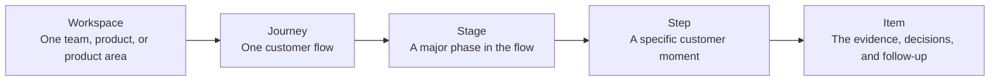

Custory is a living system for customer journeys.

It stays current because [signals](/signals) flow in, the team turns those signals into structured [items](/items), [automations](/automations) keep repeated work moving, AI helps maintain the workspace, and shipped work can connect back to the same map.

Underneath that living layer is a simple structure:

**Workspace -> Journey -> Stage -> Step -> Item**

If you understand that model, the rest of the product becomes much easier to use well.

## Why Custory works like a living system

A whiteboard, doc, or static diagram usually goes stale because the customer story changes faster than the artifact does.

Custory is designed to avoid that drift:

- [signals](/signals) bring in raw customer evidence from analytics, support, billing, and other tools
- [items](/items) turn that evidence into structured context the team can review
- [integrations](/integrations) connect the journey to the rest of your stack
- [automations](/automations) keep recurring updates and follow-up work moving
- [AI as a workspace member](/ai-workspace-member) helps the team summarize, maintain, and extend the journey from real context
- linked delivery work keeps shipped changes tied to the customer moment they were meant to improve

This is what "operating system for customer journeys" means in practice. The journey is not just where you map the experience. It is where evidence, prioritization, follow-through, and learning stay connected over time.

## The core model: workspace to item

### Workspace

A [workspace](/workspace) is the shared home for one team, one product, or one product area.

It contains:

- members and roles
- journeys
- personas
- integrations
- notifications
- automations
- AI memory and MCP access

### Journey

A [journey](/journeys) is the main map of a customer flow.

Examples:

- new user onboarding
- activation
- trial to paid
- support escalation
- renewal risk

### Stage

A stage is a major phase in the journey.

Examples:

- discovery
- evaluation
- setup
- first value
- retention

### Step

A step is a specific customer moment inside a stage.

Good step names are concrete:

- Customer reads pricing page
- Customer connects Slack
- Customer invites teammate

### Item

An [item](/items) is a structured piece of context attached to the journey.

Custory supports five main item groups:

- [Touchpoints](/touchpoints)
- [Insights](/insights)
- [Opportunities](/opportunities)
- [Solutions](/solutions)
- [Metrics](/metrics)

This is where the journey stops being just a diagram and becomes useful for decisions.

## How signals become structured action

The item model helps teams move from raw input to follow-through.

A common flow looks like this:

1. A signal appears in analytics, support, billing, research, or delivery work
2. The signal gets attached to the right step in the journey
3. The team turns it into structured items
4. The linked items make the reasoning visible
5. Prioritization and delivery happen from that shared context

### What each item type does

- A touchpoint shows where something happens in the journey.
- An insight explains what the team learned.
- An opportunity frames the problem worth solving.
- A solution captures the proposed or shipped response.
- A metric tells you whether the response worked.

### Example chain

- Signal: setup completion drops after the Slack connection step
- Touchpoint: customer connects Slack
- Insight: non-technical admins hesitate at the permissions prompt
- Opportunity: reduce setup friction after Slack connection
- Solution: add clearer guidance and a retry path
- Metric: setup completion rate after Slack connection

## Other parts of the system

### Personas

[Personas](/personas) are reusable customer profiles stored at the workspace level.

They help the team ask who the journey is really for and whether a problem affects the buyer, admin, or end user.

### Integrations

[Integrations](/integrations) connect Custory to the systems your team already uses, such as Slack, GitHub, Notion, PostHog, Stripe, Figma, or MCP clients.

### Automations

[Automations](/automations) help you turn repeated work into scheduled or event-based workflows.

### AI

[AI as a workspace member](/ai-workspace-member) means AI works from the same context as the team instead of from isolated prompts.

## Where each part helps most

Use Custory this way:

- use journeys to map the customer flow
- use items to attach evidence and decisions
- use signals when you need to understand where fresh customer input is coming from
- use personas when the customer type changes how you interpret the flow
- use integrations when context or follow-up lives in another tool
- use automations when the same work keeps happening
- use AI when it saves real time on messy operational work

## Patterns that break the system

<AccordionGroup>
  <Accordion title="Treating the hierarchy like bureaucracy">
    The model exists to create clarity, not overhead.
  </Accordion>
  <Accordion title="Writing abstract step names">
    Customer-language steps are easier to review, search, and improve.
  </Accordion>
  <Accordion title="Creating structure without evidence">
    A journey becomes valuable when items, comments, and follow-up work are attached to the right moments.
  </Accordion>
</AccordionGroup>

## What a healthy Custory system looks like

Your team should be able to answer:

- what part of the journey this issue belongs to
- what evidence supports it
- who it affects
- what the next action is
- how success will be measured

## Next step

- Read [Quickstart](/quickstart) if you are setting up the workspace now.
- Read [Signals](/signals) if you want the clearest explanation of where customer input comes from and how it becomes structured work.
- Read [Journey editor](/journey-editor) to see how the main work surface is organized.
- Read [Items](/items) to understand how evidence, problems, and solutions connect.
