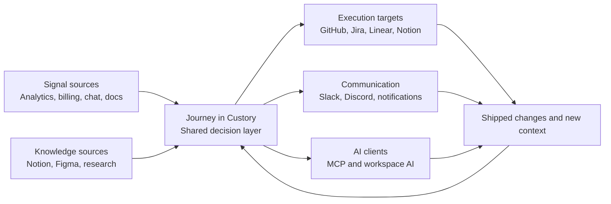

Custory integrations connect the flow of work around the [journey](/journeys).

[Signals](/signals) come in from tools like analytics, billing systems, docs, and chat. The journey becomes the decision layer where your team interprets those inputs. Work and updates then flow back out to delivery tools, communication channels, and [AI clients](/mcp-server).

The goal is not to connect everything. The goal is to connect the few systems that already shape how your team learns, decides, and ships.

## The connected stack in practice

Think about integrations in four roles:

1. signal sources
2. the journey as the decision layer
3. execution targets
4. communication channels and AI clients

This framing keeps each integration tied to a job instead of turning the page into a feature list.

## What to connect first

For most founder-led and product-led teams, the best order is:

1. One communication tool
2. One delivery tool
3. One knowledge or context source
4. Analytics or revenue signals if they shape roadmap decisions often

That usually means something like:

- Slack or Discord
- GitHub, Jira, or Linear
- Notion or Figma
- PostHog or Stripe

## Signal sources

Signal-source integrations bring raw customer evidence into the system before your team turns it into [items](/items).

### PostHog and Stripe

Use [PostHog and Stripe](/posthog-and-stripe) when product usage, conversion, billing, churn, or recovery movement should shape how the team interprets the journey.

### Notion and Google Drive

Use these when research notes, docs, or structured background material already hold the best version of the customer story.

### Figma and Miro

Use these when visual flow context, prototypes, or collaborative workshop material should help shape the journey.

### Intercom and customer feedback surfaces

Use feedback sources when recurring customer pain, objections, or questions need to survive beyond the original conversation.

## Execution targets

Execution-target integrations help your team move from a prioritized opportunity to real delivery work.

### GitHub

Use GitHub when journey context should stay connected to issues, pull requests, and shipping activity.

See [GitHub integration](/github-integration).

### Jira and Linear

Use Jira or Linear when [opportunities](/opportunities) and [solutions](/solutions) need structured execution follow-up in your team's delivery system.

### Notion as linked work

Notion can also support lighter-weight operational follow-up where a full engineering issue is not the right artifact.

See [External tasks and issues](/external-tasks).

## Communication channels

Communication integrations keep the journey visible without forcing the team to live in Custory all day.

See [Notifications](/notifications) when you want to control how those updates are delivered.

### Slack

Use Slack to:

- send automation updates to channels
- link personal identities for direct-message [notifications](/notifications)
- work with Custory [AI](/ai-workspace-member) from collaboration threads

### Discord

Use Discord to:

- send updates into channels and threads
- link personal identities for direct-message [notifications](/notifications)
- work with Custory [AI](/ai-workspace-member) in conversation-heavy workflows

See [Slack and Discord AI threads](/slack-discord-ai-threads).

## AI clients and developer access

AI-related integrations matter because they let outside tools work from the same [journey context](/how-custory-works) instead of from isolated prompts.

### MCP server

Use the [MCP server](/mcp-server) when external AI clients or developer workflows should read from Custory context safely.

That is useful for:

- Building a journey from existing source material through [AI journey imports](/ai-journey-imports)
- Generating follow-up tasks from real workspace context
- Running Slack or Discord collaboration threads
- Using [automation templates](/automation-templates) that rely on PostHog, GitHub, Jira, or Linear

## How the journey fits in the middle

Integrations are most useful when the journey stays in the center:

- signals come in
- the team interprets them in journey context
- priorities become [opportunities](/opportunities) and [solutions](/solutions)
- work flows out to the right systems
- shipped changes and new signals come back in

That loop is what makes the stack connected instead of fragmented.

## Integration management

Open **Manage Integrations** in a workspace to:

- Connect tools
- Reconnect expired integrations
- Review connection state
- Add manual credentials where required
- Request unsupported integrations

## Good integration hygiene

### Connect only the tools that remove real friction

More integrations are not automatically better.

### Set journey defaults where relevant

If one journey always routes work to the same repo, team, or project, set that default once instead of relying on memory in [journey settings](/journey-settings).

### Keep delivery links close to item context

The integration is most valuable when it keeps the reason for the work visible, not just the task itself.

## Next step

- Read [Signals](/signals) if you want the clearest explanation of what flows into Custory from the rest of the stack.
- Read [GitHub integration](/github-integration) if delivery handoff is your next use case.
- Read [Notifications](/notifications) if you want Slack or Discord delivery set up cleanly.
- Read [MCP server](/mcp-server) if your team wants external AI clients to use Custory context.
