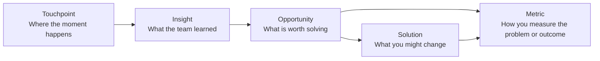

Fields and links are what make items operational instead of vague. They give your team enough structure to review work quickly without losing the reasoning behind it.

## What you can structure on an item

This page covers two things:

- the fields and properties available on each item type
- the relationship model for linking items together

The goal is not to fill every property because the UI allows it.

The goal is to make each item actionable enough that the team can trust it later and trace how one piece of evidence led to a real decision.

## Core fields

Every item starts with shared basics such as:

- description
- status
- owner where supported

Use the description for:

- what happened
- why it matters
- what evidence supports it
- what the team still does not know

## Group-specific properties

### Touchpoints

Key properties:

- channel
- actor

<Tip>
  Use these to answer where the experience is happening and who is involved. If the same step feels different for a buyer, admin, and end user, the `actor` field is what keeps that distinction visible.
</Tip>

### Insights

Key properties:

- type
- confidence
- severity
- affected segment

Use these to separate what the team learned from how certain or painful it is.

### Opportunities

Key properties:

- owner
- impact
- effort
- priority
- confidence

Use these to frame action and prioritization.

### Solutions

Key properties:

- owner
- solution type
- impact
- effort
- priority
- target date

Use these to compare candidate responses and manage follow-through.

### Metrics

Key properties:

- owner
- metric type
- unit
- baseline
- current
- target
- direction

Use these to keep progress measurable.

## How linking keeps the logic visible

Linking items is how you turn a journey from a collection of notes into a decision system.

Allowed relationships:

- Touchpoint -> Insight
- Insight -> Opportunity
- Opportunity -> Solution
- Opportunity -> Metric
- Solution -> Metric

This model is intentional. Custory is helping you preserve causality, not create an unrestricted graph.

## What each link means

### Touchpoint -> Insight

Use this when a customer-facing moment revealed something worth learning.

### Insight -> Opportunity

Use this when a learning becomes a problem worth prioritizing.

### Opportunity -> Solution

Use this when you are proposing or shipping a response to the problem.

### Opportunity or Solution -> Metric

Use this when a metric helps define whether the problem is real or whether the response worked.

## A practical linking pattern

The cleanest pattern is:

1. capture the touchpoint or insight first
2. link the learning to the opportunity it creates
3. link the opportunity to one or more possible solutions
4. link the opportunity or solution to the metric that defines success

Example:

- Touchpoint: trial signup form
- Insight: non-technical admins do not understand what data is required
- Opportunity: reduce signup uncertainty
- Solution: rewrite the form guidance
- Metric: trial completion rate

## Common mistakes

<AccordionGroup>
  <Accordion title="Using every available field">
    Too much structure too early creates overhead. Start with the fields your team will actually review, sort, or act on, then add more only when they improve real workflows such as prioritization or handoff.
  </Accordion>
  <Accordion title="Linking everything to everything">
    If every item links to every other item, traceability becomes noise. Create links only when the relationship changes a decision, clarifies the reasoning, or makes a later review meaningfully easier.
  </Accordion>
  <Accordion title="Treating opportunities like raw note buckets">
    Keep learnings, problems, and responses separate enough to reason about them clearly. If the team learned something, write an insight. If the team wants to act on it, frame the opportunity separately so the logic stays readable.
  </Accordion>
</AccordionGroup>

## What a strong item structure looks like

A good item structure lets the team see:

- what kind of thing they are looking at
- how mature it is
- who owns it
- what caused it
- what should happen next

## Next step

- Read [Items](/items) for the overview of the item model.
- Read [Journey editor](/journey-editor) to review and filter items in context.
- Read [Metrics](/metrics) if you want help using measurement fields well.
