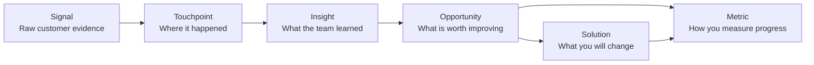

Items are how your team captures evidence, frames problems, tracks solutions, and measures progress without losing the customer moment those decisions belong to.

Stages and steps describe the journey structure. Items hold the context that makes that structure useful.

## Read this section in order

If you are new to Custory's item model, read these pages in this sequence:

1. [Items](/items)
2. [Touchpoints](/touchpoints)
3. [Insights](/insights)
4. [Opportunities](/opportunities)
5. [Prioritize with customer context](/prioritize-with-customer-context)
6. [Solutions](/solutions)
7. [Metrics](/metrics)

That order matches how teams usually move from customer evidence to action. Touchpoints ground the journey, insights explain what you learned, opportunities define what is worth fixing, solutions capture the response, and metrics tell you whether the response worked.

## Why items matter

Items are the structured records your team attaches to the journey.

They capture:

- evidence
- customer learning
- problems worth solving
- candidate or shipped responses
- metrics that keep the work honest

A journey without items is usually just a diagram.

A journey with strong items becomes a working system the team can use for:

- [prioritization](/prioritize-with-customer-context)
- delivery handoff through [external tasks](/external-tasks)
- cross-functional review
- [AI-assisted workflows](/ai-workspace-member)
- [automations](/automations)

This is also where [signals](/signals) become usable. A raw signal from analytics, support, billing, or feedback only becomes reusable team context after it is turned into linked items.

## The five item groups

Custory supports five core item groups.

### [Touchpoints](/touchpoints)

Customer-facing moments, surfaces, or interactions.

Examples:

- pricing page
- signup form
- invite email
- support chat

### [Insights](/insights)

Learnings about the customer experience.

Examples:

- users understand the promise but not the setup
- buyers care more about rollout clarity than feature depth
- failed payment emails create avoidable confusion

### [Opportunities](/opportunities)

Problems or leverage points worth acting on.

Examples:

- reduce setup friction for non-technical admins
- shorten time to first team value
- improve billing recovery confidence

### [Solutions](/solutions)

Candidate or shipped responses to an opportunity.

Examples:

- add a guided setup checklist
- rewrite failed-payment copy
- create a founder onboarding playbook

### [Metrics](/metrics)

The numbers that tell you whether the problem matters and whether the response worked.

Examples:

- activation rate
- median time to first integration
- trial-to-paid conversion
- refund volume

## How items connect

The item model is deliberately connected.

The most common chain is:

- a [touchpoint](/touchpoints) reveals an [insight](/insights)
- an [insight](/insights) leads to an [opportunity](/opportunities)
- an [opportunity](/opportunities) is addressed by a [solution](/solutions)
- an [opportunity](/opportunities) or [solution](/solutions) is judged by a [metric](/metrics)

Example:

- Signal: users stall after the invite teammate step
- Touchpoint: customer reaches the invite teammate step
- Insight: solo admins are not ready to involve others yet
- Opportunity: reduce pressure at the teammate invite step
- Solution: add a skip-and-return-later path
- Metric: invite completion rate within 3 days

## Where the working context lives

Open an item when you need the full working context.

Detailed item views can include:

- description
- files and attachments
- screenshots and image gallery
- external links with titles and descriptions
- comments
- linked items
- linked external tasks
- item history

See [Rich item details](/rich-item-details) for the full breakdown of what can live inside an item.

Keep the proof close to the claim. If an item makes a strong statement, attach the evidence whenever possible.

## How small teams should use items

The goal is not to capture everything.

The goal is to:

- capture the evidence that changes decisions
- add the fields that support prioritization and follow-through
- link the work so the reasoning stays visible

## Item mistakes to avoid

<AccordionGroup>
  <Accordion title="Using items as generic note buckets">
    Each item type should do a specific job. Use touchpoints for moments, insights for learnings, opportunities for problems worth solving, and solutions for responses so the map stays easy to reason about.
  </Accordion>
  <Accordion title="Keeping evidence outside the item">
    If the proof lives only in Slack, a ticket, or somebody's memory, the map becomes weaker. Attach the evidence where the claim is being made so the next person does not have to reconstruct the reasoning.
  </Accordion>
  <Accordion title="Creating lots of items without linking the reasoning">
    The evidence-to-action chain matters. Even a small number of well-linked items is more useful than a large disconnected set of notes.
  </Accordion>
</AccordionGroup>

## What a strong item system looks like

A healthy item system lets the team answer:

- what happened
- why it matters
- what problem is worth acting on
- what response is proposed or shipped
- how success will be measured

## Next step

- Read [Touchpoints](/touchpoints) to start the item chain with the customer moments your team can actually point to.
- Read [Item fields and linking](/item-fields) for structure, properties, and relationships.
- Read [Prioritize with customer context](/prioritize-with-customer-context) to compare opportunities and solutions without losing the customer reason behind them.
- Read [Search and filters](/search-and-filters) to review items at scale.
- Read [External tasks](/external-tasks) if you need item context to stay attached to delivery work.
