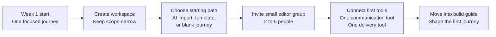

Use this guide when you want to make the right early decisions, set up the workspace cleanly, and reach a ready-to-build starting point without overcomplicating week one.

The fastest path is usually:

- create one clean [workspace](/workspace)
- choose whether to start with [AI import](/ai-journey-imports), a [template](/journey-templates), or a blank journey
- invite the right people once the setup is clear
- connect only the [tools that remove real friction](/integrations)

Most teams do not fail because they cannot draw a journey. They fail because they start too broad, invite too many editors, connect too many tools, and create a setup nobody wants to maintain. This guide keeps the first week narrow so Custory becomes useful fast.

## Before you start

Have these decisions ready:

- The first journey you want to map
- The people who should edit it
- The source material you already have
- Whether you are joining an existing workspace or creating a new one

Good first journeys for smaller teams:

- New user onboarding
- Activation
- Trial to paid
- Support escalation
- Renewal risk

Avoid starting with "the full customer lifecycle." That scope is too broad for an early working map.

`Add screenshot of workspace creation and first-start options here`

## Set up your first week in this order

<Steps>
  <Step title="Complete onboarding">
    When you first sign in, Custory walks you through onboarding. The flow typically covers your role, use case, how you found Custory, workspace creation or workspace entry, and plan selection when billing setup is required.
  </Step>
  <Step title="Create your first workspace">
    Your workspace is the shared home for one product, one product area, or one operating team. Use separate workspaces only when you need real separation such as different products, clients, or business units.
  </Step>
  <Step title="Choose the right starting path">
    From the dashboard, decide whether the first journey should start from [AI import](/ai-journey-imports), a [template](/journey-templates), or a blank journey. For most new teams, AI import is the default because it gives you a draft from your website, repo, doc, or design file instead of a blank canvas.
  </Step>
  <Step title="Invite a small editor group">
    Invite teammates after the workspace structure and starting path are clear enough that people will land in the right place instead of guessing where to work.
  </Step>
  <Step title="Connect only the tools that reduce real friction">
    Add the systems your team already checks every day instead of trying to connect everything in week one.
  </Step>
  <Step title="Move into the hands-on build">
    Once the workspace exists and the starting path is chosen, use [Your first journey (step by step)](/build-your-first-journey) for the actual building work inside the editor.
  </Step>
</Steps>

<Warning>
  If someone invited you to an existing workspace, use that route instead of creating a duplicate workspace. Read [Invited to a workspace](/invited-to-a-workspace) if you want the clean join path.
</Warning>

## Make three setup decisions before you build

Do not start by editing the journey immediately. Decide these three things first:

1. Which journey matters enough to review this week
2. Which people actually need edit access
3. Which starting path gives you the least manual setup work

If those decisions are fuzzy, the build usually gets fuzzy too.

## Prefer to start from scratch?

Use manual creation only when it is clearly the better fit.

Choose [Blank](/journeys) or [Template](/journey-templates) when:

- the flow is brand new
- the journey is still hypothetical
- no single source tells the story well enough for AI import

Even then, keep the scope narrow and move into [Your first journey (step by step)](/build-your-first-journey) as soon as the workspace is ready.

## Decide who should edit first

Most founder-led teams get the best results when they start with 2 to 5 editors, not the whole company.

Good early editors:

- founder or product lead
- one support or customer-facing teammate
- one engineering lead or product engineer
- one design or research owner if relevant

Use viewers for people who need visibility without changing the source of truth. If you need role details or invitation steps, read [Manage your team](/team-management).

## Connect only the tools that reduce real friction

Do not connect every integration during week one.

Start with the systems your team already checks every day:

- Slack or Discord for updates
- GitHub, Jira, or Linear for follow-up work
- Notion or Figma if they already hold journey-relevant source material

For a small team, one communication tool plus one delivery tool is often enough to make Custory feel operational. Read [Integrations](/integrations) when you are ready to choose them intentionally.

## Use AI where it saves real time

Custory AI is most useful when it helps you get through messy setup work faster.

Use it to:

- [draft a first journey from source material](/ai-journey-imports)
- suggest a usable first structure
- summarize source material before import
- reduce manual setup from docs, websites, repos, or design files

## First-week mistakes to avoid

<AccordionGroup>
  <Accordion title="Starting too broad">
    Pick one journey that matters now. You can add more later.
  </Accordion>
  <Accordion title="Importing everything and refining nothing">
    AI import is a starting point. You still need to shape the output into a useful working map.
  </Accordion>
  <Accordion title="Over-inviting editors">
    Start with a small accountable group. Expand later.
  </Accordion>
  <Accordion title="Treating the journey like a static artifact">
    Custory works best when the journey changes with the product, not after the product.
  </Accordion>
</AccordionGroup>

## What a strong first-week setup looks like

By the end of week one, you should have:

- one workspace
- one clearly chosen first journey
- one chosen starting path
- a small editor group
- only the first useful integrations connected
- a clear handoff into the hands-on build

## Next step

- Read [AI journey imports](/ai-journey-imports) if you want the default starting path in more detail.
- Read [Your first journey (step by step)](/build-your-first-journey) for the hands-on building walkthrough.
- Read [Invited to a workspace](/invited-to-a-workspace) if you are joining an existing team setup instead of creating your own.
- Read [How Custory works](/how-custory-works) if you want the full product model.
- Read [Integrations](/integrations) when you are ready to connect the tools your team already uses.
